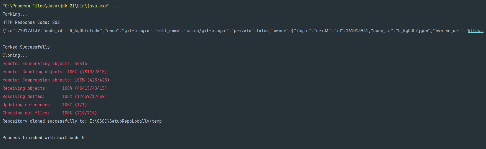

# Setup Repo Locally

This Repo forks the plugin from the jenkinsci and then clone into a temporary
folder for OpenRewrite Transformation.

Set the environmental variable TOKEN=your_token and USERNAME=your_github_username in
your IDE.

### Sample Result after Executing the code...

You can inspect the folder path to check whether the repo is cloned locally or not.
Also, you can inspect your GH repos page to check whether the repo is forked or not.

